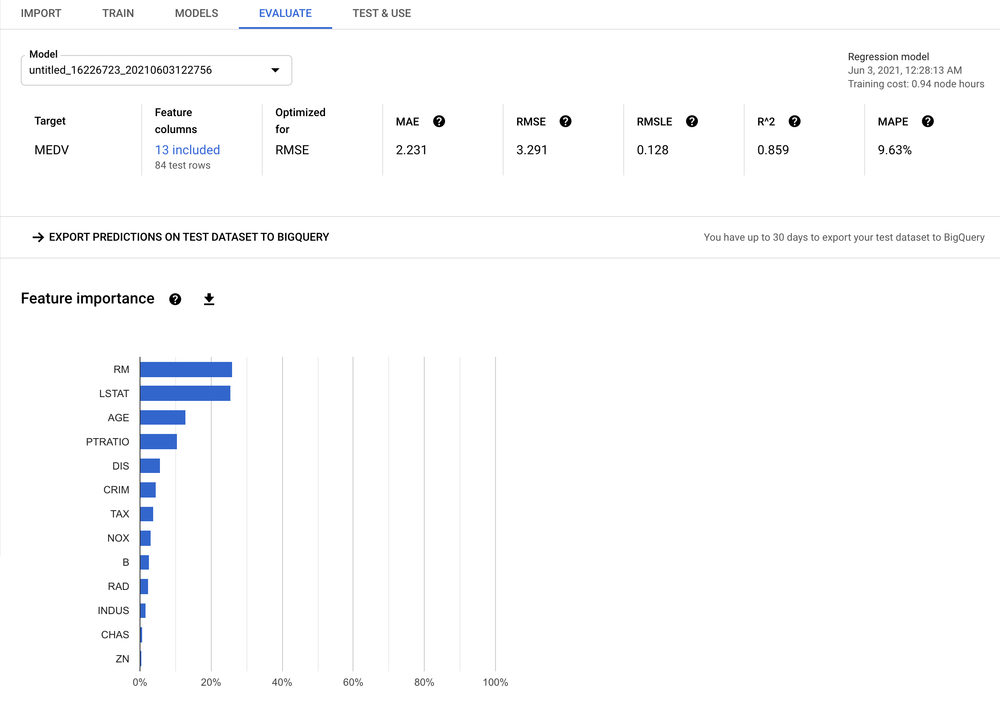

# Porównanie wyników regresji

<a href='sn_regresja_porownanie.ipynb'>Kod źródłowy - Jupyter Notebook</a>

Wartości współczynnika R2:

- regresja liniowa: 0.65
- prosta sieć neuronowa: 0.70
- model znaleziony przez AutoKeras: 0.74
- model znaleziony przez usługę AutoML w Google Cloud Platform: **0.85**

